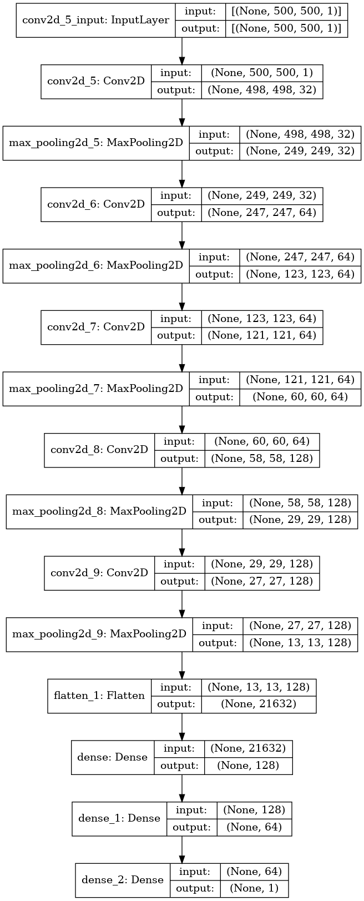

# Detection of Pneumonia withing chest X-Rays using a CNN

## Introduction

The purpose of this project is to create a more efficient and accurate way to detect pneumonia in a patient's chest x-rays. This would allow for medical personnel to focus on more pressing matters.

This project is inspired by the data set found [here](https://www.kaggle.com/datasets/paultimothymooney/chest-xray-pneumonia) on Kaggel.

The project can be found here in the notebook on github or you can run it on Kaggel [here](https://www.kaggle.com/code/andrewpcodes/peterson-final-project).

## Selection of Data

The data selected for this project can be found [here](https://www.kaggle.com/datasets/paultimothymooney/chest-xray-pneumonia). This dataset contains 3 different divisions of data train, test, validate. Each of these contains a set of x-rays that are around 1600x1200 in resolution. There is some variation in the size. With this the x-rays come in 3 channels RGB. Shape: (1600, 1200, 3) Train consists of 5216 images in 2 classes. Test consists of 624 in 2 classes. Validate consists of 16 in 2 classes. The two classes for this dataset are “Normal” and “Pneumonia”.

Here is a quick peak at some of the data in the data sets:

With this data I am using some ImageDataGenerators. One for each of the sets of data. This allows me to modify the data coming in for better evaluation of the data for the convolution NN.

With this I am using a pipeline of sorts to bring data in from the directory. This allows for faster and better data management. Using less memory by keeping the images on disk till they are being used. Again there are three of these one for each directory. 

With these data generators. I then create the model. Here is a model visualization to give a better look into what kind of layers I am using.

## Methods

Tools:

- NumPy, SciPy, Pandas, and Scikit-learn for data analysis and inference
- GitHub
- VS Code as IDE
- Tenserflow, Keras for CNN

## Over Fitting

Over fitting is an ongoing battle with CNNs. Over fitting this the case when your model has already reached its peak, most optimal, state yet the model still keeps on training. This can have the outcome of creating a worse performing model, taking more time then really needed for training, and issues that come up with over fitting. To combat this I implemented call backs as well as some reduction algorithms to help prevent over fitting my model. These can be seen in the figures below.

The outcome of these changes can be seen here. Where the model even though its slated for 25 epochs. It only runs for 4. 

## Results

The results of this project is a trained machine learning model with the ability to predict whether a patient has pneumonia or not based on chest x-rays. The current accuracy for the model is 90.3%:

With this data I was also able to predict the test data. This data the model has never seen and it should give us a good indication of how well the model is performing. With this data I made the decision to say if the percentage is above 50% so 51% and higher than I want to count it as that patient has pneumonia. This can be seen here:

With this information I am able to make a confusion matrix to show the amount of hits based on the correct labels. This can be seen here:

## Summary

This project is a good launching point for a more interactive setup. This model can be paired with more data to enhance the model more or can be added to a website where users could upload their own images and get a response.

I would use react.js to create an attractive and usable UI experience for the users. Paring that with the model you could create a powerful tool for all medical personnel to help aid their results in time of stress or have the ability to get faster response to patients.

This model could also be thought of in a different way. If this could be done with just x-rays. Are there other imaging scans that could be used to train a model and help medical personnel? MRI, CAT scans?

## References

[1] - [https://www.tensorflow.org/tutorials/images/cnn](https://www.tensorflow.org/tutorials/images/cnn)
[2] - [https://www.kaggle.com/datasets/paultimothymooney/chest-xray-pneumonia](https://www.kaggle.com/datasets/paultimothymooney/chest-xray-pneumonia)
[3] - All in class resources
